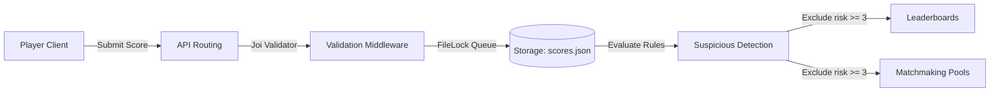

# Game Ops System

A complete production-style Node.js + Express.js backend system built for managing multiplayer game tournament events. This project highlights backend engineering practices, clean architecture, automated validation, rule-based anomaly detection, regional matchmaking, and scalability design.

---

## 1. System Flow & Architecture

The ingestion and evaluation flow of player records proceeds sequentially as follows:



### Flow Details:
1. **Player/Client**: Submits match metrics to `POST /api/scores`.
2. **API Routing & Validation**: Express parses the payload, and `validator.js` enforces fields using a schema.
3. **Storage Ingestion**: A sequential `FileLock` writes the score atomically to `data/scores.json`, protecting it from concurrent write corruption.
4. **Suspicious Detection**: Calculates risk scores. If the player violates 3+ rules, they are flagged as `Suspicious`.
5. **Leaderboard & Matchmaking**: 
   - `GET /api/leaderboard` ranks clean players by score, deaths, and kills. Suspicious players are excluded.
   - `GET /api/matchmaking` groups clean players into pools by Region, Skill Tier, and Ping Bucket.

---

## 2. Folder Structure

The project implements a **Clean Architecture** dividing logic into separated boundaries:

```text
GameOps/
├── data/
│   └── scores.json                 # Thread-safe local JSON storage
├── docs/
│   ├── architecture.md             # Production-scale system scaling document
│   ├── GameOps.postman_collection  # Postman Collection JSON export
│   └── swagger.json                # Swagger OpenAPI 3.0 specification
├── middleware/
│   ├── errorHandler.js             # Global central error catcher
│   ├── logger.js                   # Custom Winston Logger with colored console
│   └── validator.js                # Joi schema validation middleware
├── routes/
│   └── scoreRoutes.js              # Express routing mappings
├── controllers/
│   └── scoreController.js          # Controllers handling HTTP requests/responses
├── services/
│   └── scoreService.js             # Core domain/business services layer
├── utils/
│   ├── anomalyDetector.js          # Rule-based player risk scoring logic
│   ├── asyncHandler.js             # Async route wrapper for clean error forwarding
│   ├── fileLock.js                 # Safe concurrent-safe file read/write helper
│   └── matchmaker.js               # Region/Skill/Ping grouping algorithm
├── tests/
│   └── score.test.js               # Unit & integration tests (Jest + Supertest)
├── .env & .env.example             # Configuration settings
├── Dockerfile                      # Optimized multi-stage production build
├── docker-compose.yml              # Container environment compose script
├── app.js                          # Express application setup
└── server.js                       # Server launcher & listener
```

---

## 3. Business Rules

### 3.1 Leaderboard Ranking
Players are ranked according to three levels of priority:
1. **Higher Score** (Primary)
2. **Fewer Deaths** (Secondary tie-breaker)
3. **Higher Kills** (Tertiary tie-breaker)

*Note: Suspicious players (risk score $\ge 3$) are excluded from all leaderboards.*

### 3.2 Anomaly Rules & Risk Scoring
Each match record is evaluated against four specific rules:
- **Rule 1**: Score per minute > 5,000 (`score / (match_duration_seconds / 60) > 5000`)
- **Rule 2**: Kills per minute > 100 (`kills / (match_duration_seconds / 60) > 100`)
- **Rule 3**: Kills $\ge$ 100 and Deaths = 0
- **Rule 4**: Match duration < 120 seconds and Score > 50,000

Each violated rule adds **1 point** to the risk score.

| Risk Score | Tier | Action / Description |
| :--- | :--- | :--- |
| **0 - 1** | **Normal** | Safe player. Approved for leaderboards and matchmaking. |
| **2** | **Review** | Flagged. Allowed on leaderboards but visible in flagged list for manual review. |
| **3+** | **Suspicious** | High risk. Excluded from leaderboards and matchmaking pools immediately. |

### 3.3 Matchmaking Groupings
Players are clustered into queues depending on three attributes:
1. **Region** (Exact match)
2. **Skill Tier**:
   - **Beginner**: Score 0 – 5,000
   - **Intermediate**: Score 5,001 – 10,000
   - **Advanced**: Score 10,001+
3. **Ping Bucket**:
   - **Low**: Ping < 60ms
   - **Medium**: Ping 60ms – 120ms
   - **High**: Ping > 120ms

---

## 4. Setup Instructions

### Prerequisites
* [Node.js](https://nodejs.org/) (v18.0.0 or higher recommended)
* [Docker](https://www.docker.com/) (optional, for containerized run)

### Local Deployment
1. **Install dependencies**:
   ```bash
   npm install
   ```

2. **Configure environment**:
   Make sure `.env` is created. If not, copy it:
   ```bash
   cp .env.example .env
   ```

3. **Start the development server**:
   ```bash
   npm run dev
   ```
   *The server runs by default on `http://localhost:3000`.*

4. **Verify / Run tests**:
   ```bash
   npm test
   ```

---

## 5. API Reference

Interactive API documentation is served at: **`http://localhost:3000/api-docs`**

### 5.1 POST `/api/scores`
Submits a match record.

**Request Body Example**:
```json
{
  "player_id": "P099",
  "match_id": "M200",
  "region": "India",
  "device": "Android",
  "ping": 45,
  "score": 7200,
  "kills": 25,
  "deaths": 3,
  "match_duration_seconds": 480
}
```

**Response (201 Created)**:
```json
{
  "status": "success",
  "message": "Score record saved successfully",
  "data": {
    "player_id": "P099",
    "match_id": "M200",
    "region": "India",
    "device": "Android",
    "ping": 45,
    "score": 7200,
    "kills": 25,
    "deaths": 3,
    "match_duration_seconds": 480,
    "submitted_at": "2026-06-16T15:45:00.000Z"
  }
}
```

### 5.2 GET `/api/leaderboard`
Gets global ranked leaderboard of clean players.

**Response (200 OK)**:
```json
{
  "status": "success",
  "results": 3,
  "data": [
    {
      "rank": 1,
      "player_id": "P007",
      "match_id": "M007",
      "region": "India",
      "device": "Android",
      "ping": 40,
      "score": 60000,
      "kills": 2,
      "deaths": 1,
      "match_duration_seconds": 100,
      "submitted_at": "2026-06-16T10:30:00.000Z"
    },
    {
      "rank": 2,
      "player_id": "P002",
      "match_id": "M002",
      "region": "India",
      "device": "iOS",
      "ping": 80,
      "score": 4500,
      "kills": 22,
      "deaths": 3,
      "match_duration_seconds": 420,
      "submitted_at": "2026-06-16T10:05:00.000Z"
    }
  ]
}
```

### 5.3 GET `/api/leaderboard/:region`
Gets region-specific leaderboard (e.g. `/api/leaderboard/India`).

### 5.4 GET `/api/flagged-players`
Retrieves a list of flagged players (Review/Suspicious) for auditing.

**Response (200 OK)**:
```json
{
  "status": "success",
  "results": 2,
  "data": [
    {
      "player_id": "P008",
      "match_id": "M008",
      "region": "USA",
      "device": "PC",
      "ping": 150,
      "score": 60000,
      "kills": 120,
      "deaths": 0,
      "match_duration_seconds": 100,
      "submitted_at": "2026-06-16T10:35:00.000Z",
      "anomaly_details": {
        "riskScore": 3,
        "status": "Suspicious",
        "violatedRules": [
          {
            "rule": "SCORE_PER_MINUTE_EXCEEDED",
            "description": "Score per minute (36000.00) exceeded the threshold of 5000."
          },
          {
            "rule": "ZERO_DEATHS_HIGH_KILLS",
            "description": "Player achieved 120 kills with 0 deaths (potential god mode/aimbot)."
          },
          {
            "rule": "INSTANT_HIGH_SCORE",
            "description": "Player scored 60000 in a very short match (100 seconds)."
          }
        ]
      }
    }
  ]
}
```

### 5.5 GET `/api/matchmaking`
Retrieves grouped matchmaking pools of active players.

**Response (200 OK)**:
```json
{
  "status": "success",
  "results": 2,
  "data": [
    {
      "region": "India",
      "skill_tier": "Beginner",
      "ping_bucket": "Low",
      "player_count": 3,
      "players": [
        {
          "player_id": "P004",
          "match_id": "M004",
          "score": 3000,
          "ping": 35,
          "device": "Android",
          "risk_status": "Normal"
        }
      ]
    }
  ]
}
```

---

## 6. Running with Docker

1. **Build and start the containers**:
   ```bash
   docker-compose up --build -d
   ```
2. **Access local API**:
   The api is containerized and mapped to `http://localhost:3000`.
3. **Persisted Data**:
   Data is preserved across container lifecycles in the docker named volume `game-ops-data-volume`.
