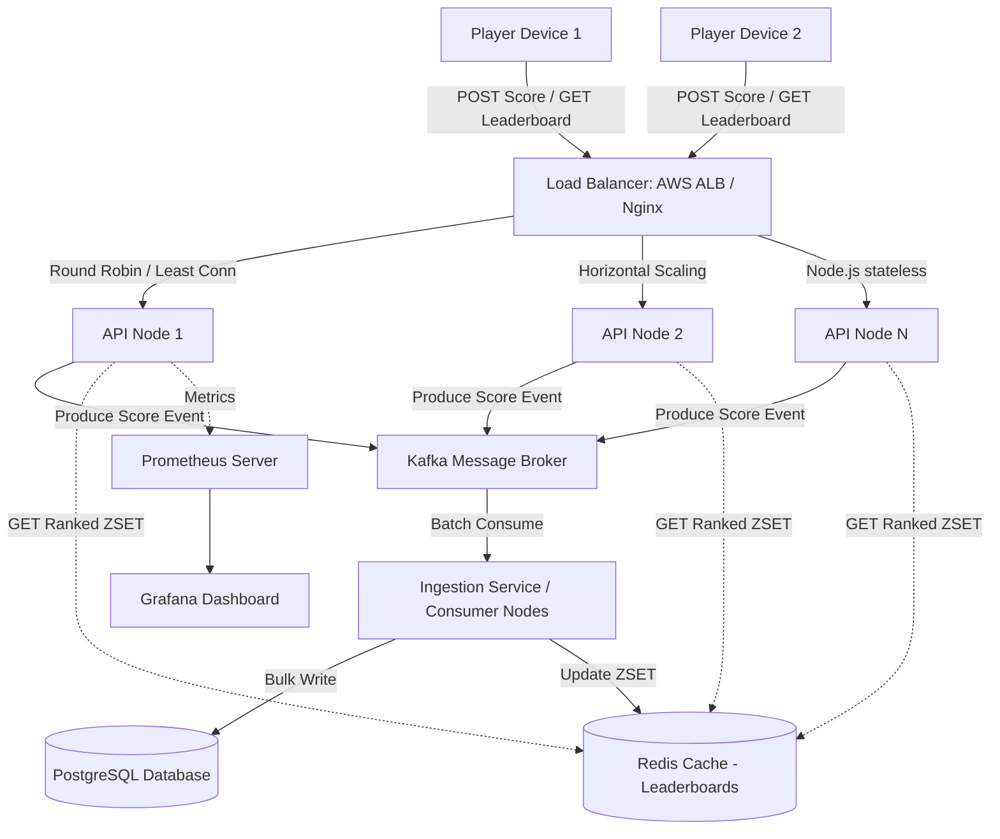

# Production-Scale Architecture: Game Ops System

This document outlines the technical strategy to scale the **Game Ops System** from supporting **2,000 players** to over **200,000+ active players** in a live multiplayer tournament setting.

---

## 1. High-Level Production Architecture

---

## 2. Key Architectural Components

### 2.1 Load Balancer & Traffic Routing
* **Technology**: AWS Application Load Balancer (ALB) or NGINX.
* **Function**: Serves as the Entrypoint (SSL termination). Employs a **least-connections** routing policy to distribute HTTP requests across a stateless pool of Node.js/Express API servers.
* **Rate Limiting**: Protects downstream APIs from DDoS or spam scores using IP-based and token-based buckets (e.g., limit to 1 score submission per match duration).

### 2.2 Horizontal Scaling of API Servers
* **Statelessness**: The API servers are stripped of local state (no local JSON files or local sessions).
* **Scaling Mechanism**: Run within a container orchestrator (Kubernetes or AWS ECS) with auto-scaling rules based on CPU utilization (>70%) and target request-per-second (RPS) metrics.
* **Worker Optimization**: Since Node.js is single-threaded, running multiple instances via clustered container deployment (1 process per CPU core) maximizes node utilization.

### 2.3 Redis Cache for Real-Time Leaderboards
At 200,000+ players, querying database aggregations on every request will cause severe database lockups.
* **Data Structure**: Redis **Sorted Sets (ZSET)**.
* **Efficiency**: 
  - `ZADD` inserts scores in $O(\log N)$.
  - `ZREVRANGE` / `ZREVRANK` fetches ranks in $O(\log N + M)$, where $M$ is the number of elements requested.
* **Implementation Details**:
  - Global leaderboard stored in a single Redis key: `leaderboard:global`.
  - Regional leaderboards stored in separate keys: `leaderboard:region:india`, `leaderboard:region:usa`.
  - To support tie-breaking (e.g., Score, Deaths, Kills), we can serialize lexicographical keys or construct a composite float score: 
    $$\text{Composite Score} = \text{Score} + (1.0 - \frac{\text{Deaths}}{100,000}) + \frac{\text{Kills}}{10,000,000}$$
    This ensures Redis ranks players automatically based on secondary and tertiary keys without code-level sorting.

### 2.4 Relational Database Migration (PostgreSQL)
* **Storage Engine**: Migrate from local `scores.json` to **PostgreSQL** for ACID compliance, transactional integrity, and rich indexing.
* **Schema & Partitioning**:
  - Create a `scores` table indexed by `player_id` (hash), `match_id` (unique), and a composite index on `(score DESC, deaths ASC, kills DESC)`.
  - Partition the table by `region` or `submitted_at` (range partitioning) to ensure queries scan only relevant data shards.
* **Read-Write Splitting**: Set up a PostgreSQL cluster with 1 primary node (writes) and multiple read replicas. The API nodes route leaderboard GET queries to replicas and ingestions to the primary.

### 2.5 Asynchronous Processing via Message Queues
Ingesting scores directly into PostgreSQL on every client request creates a bottleneck during concurrent match endings.
* **Technology**: Apache Kafka or RabbitMQ.
* **Workflow**:
  1. The API server validates incoming score requests (using Joi schemas) and instantly produces an event to the `player-scores-topic` in Kafka.
  2. The API server returns a fast `202 Accepted` to the client.
  3. A group of background consumer nodes (written in Node.js or Go) batch-consume these events.
  4. The consumer executes anomaly detection logic. If clean, it performs a bulk insert to PostgreSQL and updates the Redis ZSET.
* **Benefits**: Backpressure management, decoupling of write pathways, and high fault tolerance (if the DB goes down, events remain queued in Kafka).

### 2.6 Monitoring and Observability
* **Prometheus**: Polls endpoints (using libraries like `prom-client`) to collect custom metrics:
  - System performance: CPU usage, Memory heap size, Active event loop lag.
  - Business metrics: Ingested match count, flagged player count, matchmaking queue times.
  - Network: HTTP request latency (95th and 99th percentiles).
* **Grafana**: Pulls from Prometheus to generate real-time monitoring dashboards, with alert rules hooked up to Slack or PagerDuty for anomalies (e.g., error rate > 1%).

### 2.7 Deployment Strategy
* **Containerization**: App is built into a minimal Docker image based on `node:alpine`.
* **Orchestration**: Kubernetes (EKS / GKE) manifests manage the service deployments:
  - **Horizontal Pod Autoscaling (HPA)** scales pods dynamically.
  - **Readiness/Liveness probes** ensure traffic is not routed to failing nodes.
  - **Rolling updates** guarantee zero downtime when releasing new patches.

---

## 3. Scalability Matrix

| Metric / Scale | Prototype (2,000 Players) | Production Scale (200,000+ Players) |
| :--- | :--- | :--- |
| **Data Storage** | Local JSON File (`scores.json`) | PostgreSQL Cluster (Read Replicas + Partitioning) |
| **Write Strategy** | Sequential File Writes (`FileLock`) | Asynchronous Batching via Apache Kafka |
| **Leaderboard Queries** | In-memory sorting on read | Redis Sorted Sets (`ZSET`) |
| **Matchmaking** | Full database scans on request | Redis-backed ephemeral matchmaking lobbies |
| **Hosting Environment**| Single Virtual Machine | Kubernetes Cluster (EKS) across Multi-AZs |
| **Throughput (RPS)** | ~50 RPS | 10,000+ RPS |
